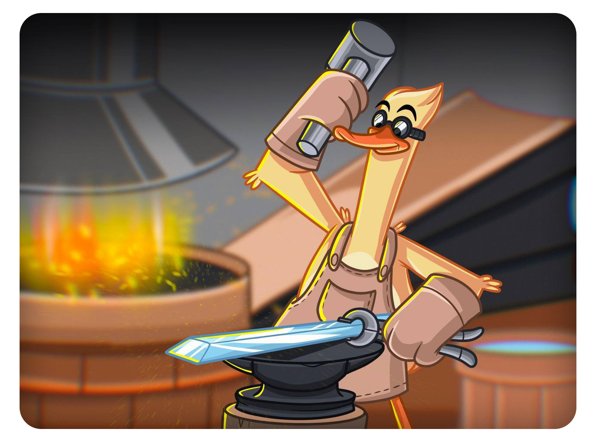
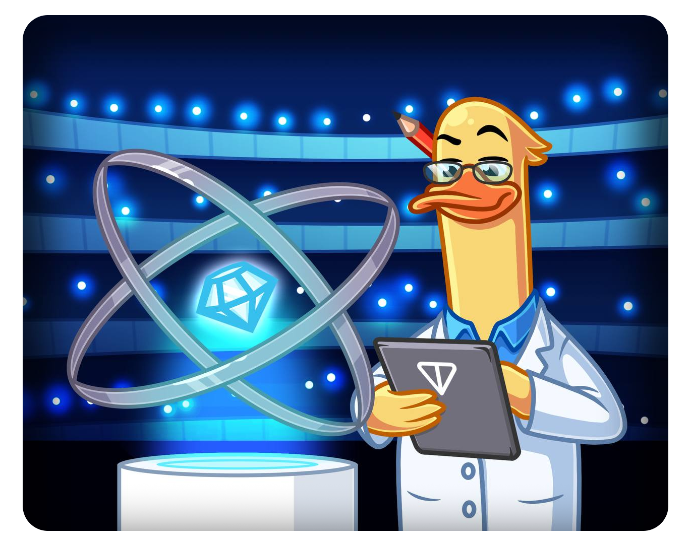

<h1 align="center">TON Community 💎</h1>

<i>Home for community-driven projects and resources for the TON blockchain.</i>

---

## Who we are

We are a group of TON enthusiasts who want to help the community to grow and thrive. 

Some of us are developers, some are researchers, some are just interested in the project. We are all united by the desire to make TON a success.

And you can become one of us. Read about how to join below.  
*It's easy!*

---

## What we do

Our solution is focused to make a life of every TON Developer easier. We build a TON Infrastructure layer. We are building a community-driven resource center for the TON blockchain. Documentation, tools, and more.

For example - we maintain the official TON Documentation, which is available at [ton.org/docs](https://ton.org/docs).

Also, we're taking care about other useful tools for developers such:
- [VS Code extension](https://github.com/ton-community/vscode-func) for FunC language.
- [TON Compiler](https://github.com/ton-community/ton-compiler) - Packaged Func compiler for TON smart contracts.
- [FunC-js](https://github.com/ton-community/func-js) - Cross-platform bindings for TON FunC compiler.
- find more [repositories](https://github.com/orgs/ton-community/repositories)

---

## How to join the open-source?

If you are a developer, you can contribute to the projects, or add your own. Also, we are looking for people who can help with documentation.

In addition, here you can get help in creating such projects, that useful for the community. If you help community - community helps you. Win-win situation.

To receive compensation, you can write a [TON Footstep](https://github.com/ton-society/ton-footsteps) or find an already placed one.

---

## How to join the open-source?

__Want to contribute?__

Choose a project, fork the repo, make your changes, and submit a pull request.

__Maybe you have created a tool that solves some problem?__

Get more TON Developers by adding your tool to the:
* [TON Documentation](https://github.com/ton-community/ton-docs)
* [awesome-ton](https://github.com/ton-community/awesome-ton)

__Want to get more contributors?__

* And of course you can add a repository to the organization! Just contact us through the [Telegram group](https://t.me/ton_dev_community)

---

<h3 align="center">Projects looking for contributors:</h3>

- [TON Documentation](https://github.com/ton-community/ton-docs) — knowledgebase for every thing in TON. Essential instrument of every TON Developer.